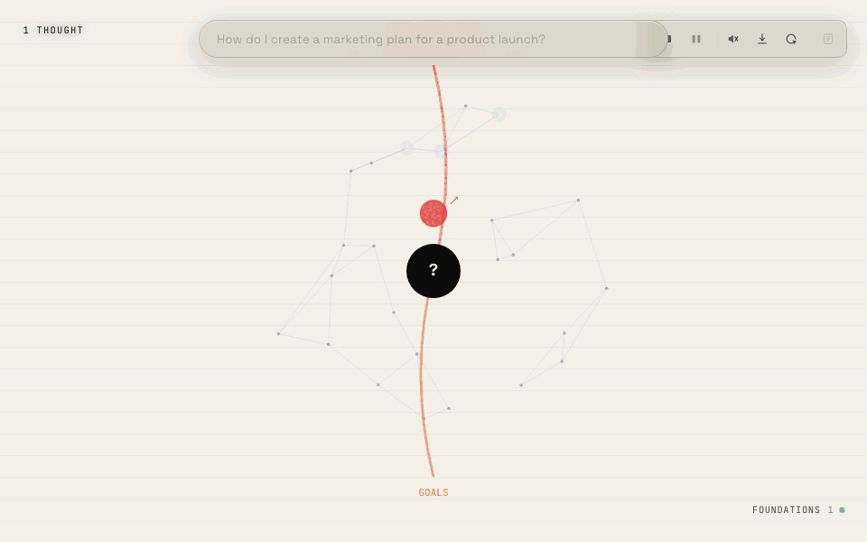

<div align="center">
  
</div>

# clinky — thinking made visible

[](https://www.npmjs.com/package/@ichbinsoftware/clinky)
[](https://github.com/ichbinsoftware/clinky/blob/main/LICENSE)
[](https://nodejs.org)

A visual and sonic surface for AI thinking. Works with **claude**, **copilot**, and **codex**. The name: *cli + thinking = clinky*.

Not a chat interface. Not a document. A living map of how a thought unfolds — branches, choices, narrowings, dead ends, resolutions — rendered as something you'd want to look at and listen to.

## Demo

<div align="center">
  
</div>

_Live replays at [clinky-demo.ichbinsoftware.com](https://clinky-demo.ichbinsoftware.com/) — install locally to run your own prompts._

## Install

```bash
npm install -g @ichbinsoftware/clinky
```

Then run:

```bash
clinky               # default: claude backend, port 4243
clinky --open        # also opens the browser for you
```

Open **http://localhost:4243** in your browser (substitute your `--port` if you changed it). Pick a mode, type a question, press think.

### Flags

```bash
clinky --open                        # also opens the browser for you
clinky --agent copilot               # use GitHub Copilot CLI
clinky --agent codex                 # use OpenAI Codex CLI
clinky --agent antigravity           # use Google Antigravity CLI (agy)
clinky --agent cursor                # use Cursor CLI (cursor-agent)
clinky --agent qwen                  # use Qwen Code CLI
clinky --model claude-opus-5         # default model for the default agent only
clinky --port 4244                   # change port
clinky --record                      # save every session to ~/.clinky/sessions/
clinky --verbose                     # log every node arrival to stderr
```

`--model` applies only to the agent `--agent` selected. A request that names a
different backend (`?agent=`) uses that backend's own default instead, so a
model id is never handed to the CLI it doesn't belong to.

Recorded sessions are listed at `/api/sessions`. Replay any via `/api/replay/<id>` — append `?speed=` (default 4×, 0 = instant) to control playback rate.

`?agent=` and `?model=` on any URL override the defaults for that request — use them from `/inspect` to make a new request with a different backend or model without restarting.

### Requirements

- Node 18+
- At least one agent backend installed and authenticated:
  - **claude** (default) — `npm i -g @anthropic-ai/claude-code`
  - **copilot** — `npm install -g @github/copilot`
  - **codex** — `npm i -g @openai/codex`
  - **antigravity** — Google Antigravity CLI (`agy`, from antigravity.google)
  - **cursor** — Cursor CLI (`curl https://cursor.com/install -fsS | bash`)
  - **qwen** — Qwen Code CLI (`npm i -g @qwen-code/qwen-code`)

On startup clinky prints which of these are actually on your PATH, so a missing
CLI shows up before you send a request rather than as a spawn error mid-session.

### Agent notes

**copilot** is opt-in rather than the default for a reason: the CLI has removed flags without deprecation notice before, breaking adapters silently. If a copilot update breaks the integration, switch back to `--agent claude`. Effort `max` clamps to `xhigh`.

**codex** requires the working directory to be inside a trusted git repo (`--skip-git-repo-check` is passed automatically). No effort knob — reasoning depth is set by the model variant.

**claude** is the only backend with prompt-cache control, so the large system prompt stays cacheable across requests — noticeably faster on repeated runs.

**antigravity** (`agy`) runs with `--dangerously-skip-permissions`: headless agy soft-denies unapproved tools, and clinky's echo calls must execute. No effort flag — depth is encoded in the model variant (e.g. `Gemini 3.1 Pro (High)`), and model values are agy's display names verbatim.

**cursor** (`cursor-agent`) runs with `--trust --force`; without `--force` the CLI rejects tool calls even in print mode. No effort flag — depth is encoded in the model id (`cursor-agent --list-models` lists ~200, spanning multiple vendors).

**qwen** needs model ids that exist in your own `~/.qwen/settings.json` `modelProviders` — the `/inspect` list assumes the Model Studio set, and an unknown id fails loudly on stderr. Runs with `--approval-mode yolo` (headless qwen denies the shell tool by default) and `--safe-mode`. Model choice matters more here than on other backends: `qwen3.8-flash` (the default) returns a first node in ~9s, while `qwen3.8-max` has better schema compliance but spends minutes thinking before its first node.

### A note on capabilities

The CLI agents are general-purpose AI tools with file access, Bash, and OS-level integrations. clinky's system prompt constrains them to emit thought nodes, but a prompt like *"write a CLI that gets weather based on location"* may still cause the agent to reach for GPS, calendar, or filesystem. On macOS this triggers permission dialogs — you can deny them; clinky itself only needs network access. Keep prompts conceptual (*"how would I design a weather CLI?"*) to stay in pure thinking mode.

## Running from source

```bash
git clone https://github.com/ichbinsoftware/clinky
cd clinky
node server.js
```

Open **http://localhost:4243** in your browser (substitute your `--port` if you changed it). Same flags as the published CLI.

## How it works

1. User types a prompt and presses **think**
2. Server spawns the selected agent with a system prompt instructing it to emit thought nodes via Bash tool calls (one `echo '{...}'` per thought)
3. Each Bash invocation arrives in real time — no waiting for the full response
4. Server extracts JSON from the Bash output, classifies topics, assigns colors + notes
5. Nodes stream to the browser via SSE
6. Each mode renders the node as a visual element with a synthesized sound

The Bash commands are never executed. The call is a delivery mechanism — the server parses JSON out of the command string and discards it. Bash is used because it's universal across all three backends and provides a real-time `tool_use` event the instant the model invokes it, before output is ready. The model is asked to batch 3–4 thoughts per call for speed.

### The thought node

```json
{
  "id": 12,
  "topic": "channels",
  "type": "choice",
  "text": "for most launches: one owned + one paid",
  "confidence": 0.75,
  "stance": "claiming",
  "refs": [9, 10, 11],
  "rel": "synthesizes",
  "because": [9, 10, 11],
  "heat": 0.4
}
```

- **types:** `claim`, `branch`, `choice`, `dead-end`, `aside`, `resolution`
- **stance:** `exploring` | `claiming` | `questioning` | `conceding`
- **rel:** `supports` | `contradicts` | `synthesizes` | `refines` | `questions` | `supersedes` (required when `refs` is set)
- **because:** array of prior ids, or `"external"` / `"prior"` (required on `claim`, `choice`, `resolution`)
- **heat:** 0–1 — reserved for unexpected or consequential moves

Each response carries 4–8 **topics**, each assigned a stable color and a pentatonic note for the session.

Server-stamped on every node: `batch_id`, `batch_position`, `elapsed_ms`, `incoming_refs_count` (how many later thoughts reference this one — delivered via a separate `graph` SSE event).

The relational fields turn the stream into a reasoning trace rather than a list. Open `/inspect` during any session for live coverage of the fields.

### The reflection

At the end of every session the model emits one final `type: "reflection"` node — a single sentence of meta-commentary on its own thinking. It surfaces in the reading-pane essay panel as a closing block, not on the canvas.

## The 31 modes

### Field & Canvas — painting, mark-making, gesture

| Mode | What happens |
|------|-------------|
| **marko** | rothko-style horizontal color bands; height = weight, edges bleed |
| **splatter** | pollock-style action painting — wandering lines + droplets per thought |
| **ink** | sumi-e brush strokes on cream paper; ink bleeds, then holds |
| **concrete** | concrete poetry — text arranges itself as shapes |
| **mycelium** | fungal network — nodes glow, hyphae grow, tendrils probe |

### Sky & Cosmos — expansive, mythic, open

| Mode | What happens |
|------|-------------|
| **galaxy** | spiral arms rotating; thoughts as stars drifting outward |
| **constellation** | stars cluster by topic and auto-connect; click two stars to draw your own line |

### Physics & Emergence — forces, motion, simulation

| Mode | What happens |
|------|-------------|
| **gravity** | physics sim — same-topic shapes attract, all repel |
| **antmin** | swarm of creatures flock by topic; click to scatter |
| **conway** | game of life — each thought seeds a cell pattern |
| **bounce** | thoughts drop and bounce off topic platforms; sound on impact |
| **tracer** | swimmers leave trails; drag to create currents |
| **snowfall** | branching crystals drift down and accumulate |
| **loop** | spinning rings of light, one per topic, points orbit |

### Grid & Geometry — built forms, sequences, regular grids

| Mode | What happens |
|------|-------------|
| **luminaria** | arrows on a grid; particles follow them in loops |
| **sequencer** | 16-step grid sequencer; rows = topics, columns = beats |
| **loom** | weaving — warp fixed, weft rows are thoughts |
| **subway** | transit map — each topic a coloured line, thoughts are stations |
| **clockwork** | meshing gears — each topic a gear, thoughts pulse the rotation |
| **city** | isometric city grows — topics are districts, confidence is height |

### Data & Structure — analytical diagrams, signal forms

| Mode | What happens |
|------|-------------|
| **attention** | pairwise weight matrix between thoughts |
| **dendrogram** | hierarchical cluster tree, bottom-up |
| **waveform** | oscilloscope trace, one lane per topic, type-specific bursts |
| **chord** | circular arc diagram with chords connecting same-topic pairs |

### Frame & Chart — strategy-deck and workshop-wall diagrams

| Mode | What happens |
|------|-------------|
| **mindmap** | radial Buzan-style mindmap from a central prompt hub |
| **stickies** | wall of tilted, drop-shadowed Post-its packed in rows |
| **swot** | 2×2 strategic grid mapped from thought type |
| **fishbone** | Ishikawa cause-and-effect diagram |
| **pyramid** | Minto answer-first 4-tier pyramid |
| **matrix** | impact × confidence scatter plot with named quadrants |
| **journey** | customer-journey emotion curve across five phases |

## Sound

A Web Audio synthesis engine — no samples, no files. Each session plays as a piece of music whose structure mirrors the thinking.

**Aesthetic** (picked per mode): one of `ambient`, `classical`, `jazz`, `industrial`, `techno`, `videogame`. Each carries its own waveforms, envelopes, voicings, FX (reverb / delay / distortion), and key palette. Ambient is wide pads with long reverb; videogame is square-wave chiptune; industrial is sawtooth + crunch; classical is detuned triangle in a hall.

**Session key** is hashed from the prompt — the same prompt always plays in the same key. Each topic gets a stable note within that key, so the same topic always sounds the same across the session.

**Stance** shapes the articulation of every thought:

| Stance | How it plays |
|---|---|
| **claiming** | staccato + forte |
| **exploring** | legato |
| **questioning** | held fermata |
| **conceding** | soft decrescendo |

**Rel** between thoughts plays as a two-note interval:

| Rel | Interval |
|---|---|
| supports | perfect 5th |
| contradicts | tritone |
| synthesizes | major 3rd |
| refines | minor 2nd |
| questions | augmented 4th |
| supersedes | octave |

**Heat** (unexpected / consequential flag) boosts velocity and reverb send. **Because** grounds the thought from below: `internal` lays a pedal tone, `external` plays off-stage with extra reverb and pan, `prior` detunes flat to suggest a memory. Some aesthetics also run a rhythmic bed underneath the harmony.

## Controls

| Button | What it does |
|--------|-------------|
| **▶ think** | send the prompt, start streaming |
| **■ stop** | cancel mid-stream |
| **⏸ pause** | freeze the animation |
| **sound** | toggle sound on/off |
| **↓ save** | save canvas as PNG (2× upscale, prompt + timestamp overlaid) |
| **↺ clear** | reset canvas and state |
| **read** | open the reading pane (after session completes) |

Pressing think clears the canvas first, then streams the new session. Use clear to wipe back to an empty canvas without starting one.

Hover any element to see the thought behind it. Click to isolate a topic; click again to release. The hub/centre/spine of any radial mode is a reset handle.

## Architecture

```
browser (31 mode pages + /inspect)
  ↑ SSE: status, topics, batch, node, graph, usage, done, error
  ↑ Web Audio: per-thought synthesized tones
  │
server.js
  ├─ GET /                → mode picker
  ├─ GET /<mode>          → mode page
  ├─ GET /inspect         → diagnostic stream viewer
  ├─ GET /api/think?prompt=&mode=&model=&effort=&agent=  → SSE stream
  ├─ GET /api/sessions    → list recorded sessions
  └─ GET /api/replay/<id>?speed=&mode=  → replay a recorded session

agents/ (one file per backend)
  ├─ shared.js     ← SYSTEM_PROMPT, extractAndEmitNodes, runWithProvider
  ├─ claude.js     ← spawns claude --output-format stream-json
  ├─ copilot.js    ← spawns copilot --output-format json
  └─ codex.js      ← spawns codex exec --json
```

Every mode is a class extending `Mode` (`/public/mode.js`). The base class owns canvas setup, resize, chrome, SSE lifecycle, RAF loop. Each mode implements `draw()` and overrides hooks (`onNode`, `onClear`, `onDone`).

### Backend comparison

| | claude | copilot | codex |
|---|---|---|---|
| Real-time hook | `tool_use` (Bash) | `tool.execution_start` (bash) | `item.started` (command_execution) |
| Node source | command string | command string | stdout at `item.completed` |
| Usage event | full token + cost | `premiumRequests` only | input/output/cache tokens |
| Default model | claude-sonnet-4-6 | claude-sonnet-4.6 | gpt-5.4 |
| Node timing | streaming | streaming | per-batch |

Any model name passes through — no allowlist, new models work automatically. Effort: `low` | `medium` | `high` (default) | `xhigh` | `max`.

## No server dependencies

Server uses Node built-ins only (`http`, `fs`, `path`, `url`, `child_process`). Client is vanilla JS + Canvas API + Web Audio API. No npm packages, no bundler, no build step.

## Influences

- **Electroplankton** (Toshio Iwai, Nintendo DS) — playful, no goal, sound and visual inseparable
- **Brian Eno** — generative systems that produce music reflecting real structure
- **Edward Tufte** — information density without clutter
- **Conway's Game of Life** — emergent complexity from simple rules
- **Mark Rothko** — color as weight, presence without form

## License

MIT
